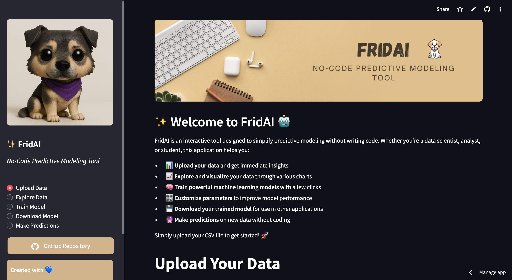

# 🤖 FridAI: No-Code Predictive Modeling Tool 🛠️

  

FridAI is an interactive web app that democratizes machine learning by allowing anyone to build, train, and deploy predictive models **without writing a single line of code**. From data exploration to model deployment, FridAI handles the entire machine learning workflow through an intuitive, visual interface that makes AI accessible to all.

## 🔍 Key Features  

- **📂 Data Upload & Intelligent Preview**: 
  - Seamless CSV file uploading with smart data type detection
  - Instant statistical summaries and data quality assessments
  - Automatic identification of potential issues in your dataset

- **📊 Advanced Exploratory Data Analysis**:  
  - Interactive histograms & boxplots with statistical annotations
  - Dynamic correlation heatmaps with significance highlighting 🔥  
  - Comprehensive categorical data insights with distribution analysis
  - Multi-variable scatter plots with regression lines and confidence intervals
  - Smart outlier detection with customizable thresholds

- **🧠 State-of-the-Art Model Training**:  
  - **Classification Models**:
    - Random Forest with tunable estimators and depth
    - Logistic Regression with regularization control
    - Support Vector Machines with kernel optimization
    - Gradient Boosting with learning rate adjustment
  - **Regression Models**:
    - Linear Regression with comprehensive diagnostics
    - Random Forest with feature importance analysis
    - Support Vector Regression with non-linear capabilities
    - Gradient Boosting with customizable tree parameters
  - Intelligent preprocessing pipeline:
    - Automated missing value handling with multiple imputation strategies
    - Feature scaling with StandardScaler, MinMaxScaler, or RobustScaler
    - Smart encoding of categorical variables (Label or One-Hot)
    - Parameter optimization for maximum performance

- **📈 Comprehensive Model Evaluation**:  
  - **Classification Metrics**: 
    - Accuracy, precision, recall, F1-score
    - Interactive confusion matrix visualization
    - Detailed classification reports with class-specific metrics
  - **Regression Analysis**:
    - MSE, RMSE, MAE, and R² measures
    - Residual analysis and error distribution
    - Actual vs. predicted plots with confidence bands
  - Visual feature importance ranking with contribution analysis

- **💾 Enterprise-Ready Model Export**: 
  - One-click download of trained models as pickle files
  - Complete metadata and preprocessing information included
  - Ready-to-use in production environments

- **🔮 Interactive Predictions**: 
  - Intuitive form-based prediction interface
  - Real-time probability visualization for classification tasks
  - Confidence intervals for regression predictions

## 🔧 Installation & Setup  

### Requirements  
- Python 3.8+ environment
- Required packages listed in `requirements.txt`
- Git (optional, for version control)

## 📊 App Screenshot

*The main interface of FridAI showing the intuitive dashboard where users can upload data, explore insights, and build machine learning models without writing code.*

## 📖 How to Use  

### 1️⃣ Upload Your Dataset  
- Upload any CSV file through the intuitive interface
- Get immediate insights into data structure, types, and quality
- Automatically detect and visualize missing values and outliers
- Understand your data before modeling begins

### 2️⃣ Explore and Visualize  
- Select from multiple visualization types to deeply understand your data
- Uncover hidden patterns and relationships between variables
- Identify potential predictive features and data challenges
- Make informed decisions about preprocessing and modeling strategies

### 3️⃣ Train Your Custom Model  
- Select your target variable and predictive features with a few clicks
- Choose the appropriate problem type (classification or regression) 
- Access an ML Algorithm Cheatsheet to guide your model selection
- Configure preprocessing steps tailored to your data characteristics
- **Automatically balance imbalanced datasets with SMOTE technology**
- **Validate models with cross-validation for robust performance metrics**
- Select and customize the perfect algorithm for your specific use case
- Train your model with a single click and monitor the process

### 4️⃣ Evaluate and Refine  
- Review comprehensive performance metrics specific to your problem type
- Visualize model behavior through intuitive plots and charts
- Understand feature importance to gain business insights
- **Export your trained model as a Python notebook with reproducible code**
- Export your trained model for implementation in other systems
- Download results and visualizations for reports and presentations

### 5️⃣ Generate Predictions  
- Enter new data points through a user-friendly interface
- Get instant predictions with confidence levels
- **Check if your input data contains unusual values that could affect reliability**
- **Use What-If Analysis to see how changing inputs affects predictions**
- Visualize prediction probabilities across different classes
- Make data-driven decisions based on model outputs
- Process multiple predictions at once with batch prediction

### 6️⃣ Educational Resources
- **Access algorithm selection guides based on your problem type**
- **Learn about model strengths and weaknesses through interactive tooltips**
- **Understand statistical concepts with clear explanations**
- Get recommendations for model improvements based on your data characteristics
- Explore feature relationships to gain deeper insights

## 💻 Technical Details

FridAI leverages cutting-edge libraries and frameworks to deliver its functionality:

- **Data Processing**: Pandas and NumPy provide robust data manipulation capabilities
- **Visualization Engine**: Matplotlib and Seaborn power the interactive visualizations
- **Machine Learning**: Scikit-learn implements the predictive algorithms
- **Web Framework**: Streamlit creates the responsive, interactive interface
- **Model Persistence**: Pickle enables model serialization and portability

The application follows a modular architecture with:
- Input validation and data quality checks
- Automated preprocessing pipeline
- Algorithm-specific parameter optimization
- Comprehensive evaluation metrics
- Exportable model artifacts

## 🔧 Technologies Used  

- **Streamlit** – Interactive web application framework
- **Pandas & NumPy** – Powerful data manipulation libraries
- **Matplotlib & Seaborn** – Advanced data visualization tools
- **Scikit-learn** – Industry-standard machine learning implementations
- **Pickle** – Object serialization and persistence

## 📄 License ⚖️  

FridAI is proudly released under the **MIT License** 🔓

### What This Means For You 🤔

The MIT License is one of the most permissive and user-friendly licenses in the open-source world:

- ✅ **Freedom to Use**: Use FridAI in your personal or commercial projects with no restrictions
- ✅ **Freedom to Modify**: Customize and enhance FridAI to fit your specific needs
- ✅ **Freedom to Share**: Distribute your modified versions to help the community grow
- ✅ **Freedom to Integrate**: Incorporate FridAI into larger systems, even proprietary ones
- ✅ **No Warranty**: While we strive for quality, the software is provided "as is"
- ✅ **Simple Attribution**: Just keep the copyright notice and permission notice

This open approach reflects our commitment to accessible AI tools that empower everyone, regardless of their coding expertise or financial resources 🌍💫

For legal precision, the complete license text is available in the [LICENSE](LICENSE) file.

Copyright (c) 2025 Jotis

## 👤 Author & Background 🧑‍💻  

Created with 💙 by [Jotis](https://github.com/Jotis86)  

### About the Creator ✨

Jotis is a passionate data scientist and software developer with a vision to democratize AI technology. FridAI emerged from the belief that powerful machine learning tools should be accessible to everyone, not just those with extensive coding experience.

### Connect & Contribute 🔗

- 🐙 **GitHub**: [Jotis86](https://github.com/Jotis86)
- 📧 **Contact**: For questions or collaborations, open an issue on GitHub
- 🌐 **Portfolio**: [Check out my other projects](https://jotis86.github.io/Website/)

## 🤝 Contributing

FridAI welcomes contributions from the community! Here's how you can help:

### Types of Contributions
- **Bug Reports**: Found an issue? Report it through GitHub Issues
- **Feature Requests**: Have ideas for new features? Share them!
- **Documentation**: Help improve or translate the documentation
- **Code Contributions**: Submit Pull Requests with fixes or features

### Contribution Process
1. **Fork the Repository**: Create your own copy of the project
2. **Create a Branch**: `git checkout -b feature/AmazingFeature`
3. **Make Changes**: Implement your bug fix or feature
4. **Run Tests**: Ensure your changes don't break existing functionality
5. **Commit Changes**: `git commit -m 'Add some AmazingFeature'`
6. **Push to Branch**: `git push origin feature/AmazingFeature`
7. **Open a Pull Request**: Submit your changes for review

### Contribution Guidelines
- Follow the existing code style and conventions
- Add tests for new functionality
- Update documentation to reflect your changes
- Reference relevant issues in your pull request

💡 Feel free to contribute via issues or pull requests!  
⭐ If you find FridAI helpful, please star the repository to help others discover it!  
📧 Questions? Reach out through GitHub issues or discussions.